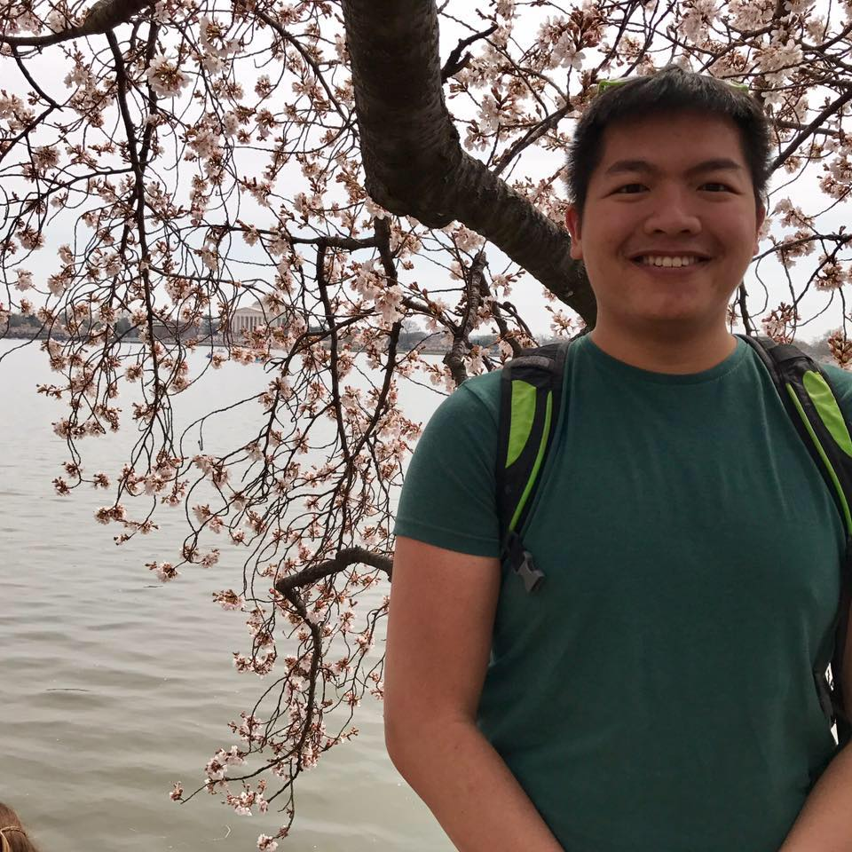



Overview
--------
I am an MD/PhD traineed in the joint MSTP at the University of Pittsburgh and Carnegie Mellon University. My research comprises utilizing genome-wide assay data to inform questions about human health and disease, with a particular focus to those of the brain. Accordingly, my clinical interests lie in neurology and psychiatry.

Research Interests
------------------
Previously while at Johns Hopkins University and then the Lieber Institute for Brain development, I worked with Drs. Brady Maher and [Andrew Jaffe](http://aejaffe.com). In Pittsburgh, I rotated with [Awndreas Pfenning](http://www.pfenninglab.org) at CMU in summer 2017 and [Anne-Ruxandra Carvunis](http://www.carvunis.com) in summer 2018. 

Contact
-------

&nbsp;&nbsp;&nbsp;BaDoi Phan 
&nbsp;&nbsp;&nbsp;[MD/PhD Trainee](http://www.mdphd.pitt.edu/students/badoi-phan) 
&nbsp;&nbsp;&nbsp;[University of Pittsburgh School of Medicine](http://medschool.pitt.edu) 
 

Email: 
&nbsp;&nbsp;&nbsp;<a href="mailto:badoi.phan@pitt.edu">badoi.phan@pitt.edu</a>
 
&nbsp;&nbsp;&nbsp;[Contact](index.html) | [CV](files/phan-cv.pdf) 
  
------------------
<a href="github.com/badoi">
